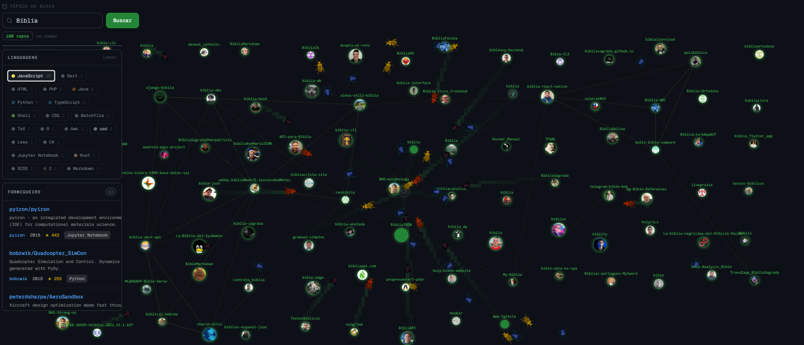

# DevColony

Uma simulação de colônia de insetos que busca repositórios no GitHub como "comida". Os insetos exploram o canvas, encontram repos e os carregam de volta ao formigueiro — usando o algoritmo ACO (Ant Colony Optimization).

   


---

## Como funciona

1. Você digita um tópico (ex: `fire simulation python`)
2. A simulação busca os 100 repositórios mais populares do GitHub com esse tema
3. Cada repo aparece como uma "comida" espalhada pelo canvas
4. As insetos exploram, encontram os repos e os carregam de volta ao formigueiro
5. O painel lateral mostra quais insetos estão carregando o quê e quais repos já foram coletados

O tamanho de cada comida é proporcional às stars do repo. Trilhas de feromônio se formam nos caminhos mais usados e evaporam com o tempo.

---

## Tecnologias

- **Next.js 16** — framework React com App Router
- **Pixi.js v8** — renderização 2D via WebGL
- **Zustand** — gerenciamento de estado da simulação
- **TypeScript** — tipagem estática
- **Tailwind CSS** — estilização dos painéis
- **GitHub Search API** — fonte dos repositórios

---

## Instalação

```bash
# Clone o repositório
git clone https://github.com/LeviMaycon/devcolony.git
cd devcolony

# Instale as dependências
npm install

# Crie o arquivo de variáveis de ambiente
cp .env.example .env.local
```

Edite o `.env.local` com seu token do GitHub:

```env
GITHUB_TOKEN=ghp_seu_token_aqui
```

Para gerar um token: [github.com/settings/tokens](https://github.com/settings/tokens) — escopo `public_repo` é suficiente.

```bash
# Inicie o servidor de desenvolvimento
npm run dev
```

Acesse [http://localhost:3000](http://localhost:3000).

---

## Estrutura do projeto

```
src/
  core/
    simulation/
      Ant.ts          — lógica e visual dos insetos
      World.ts        — estado global da simulação (Zustand)
      Pheromone.ts    — grid de feromônio com evaporação
      types.ts        — interfaces TypeScript
    components/
      canvas/
        SimulationCanvas.tsx     — canvas Pixi.js principal
        SimulationCanvasWrapper.tsx
      ui/
        SimulationSidebar.tsx    — painéis de insetos e formigueiro
        SearchBar.tsx            — busca de tópicos
    hooks/
      useGitHubSearch.ts         — integração com a API do GitHub
app/
  api/
    github/
      search/
        route.ts      — proxy para a GitHub Search API
  page.tsx
  layout.tsx
public/
  ant-sprite.png      — sprite sheet dos insetos
```

---

## Algoritmo

As insetos implementam uma versão simplificada do **ACO (Ant Colony Optimization)**:

- **Exploração** — cada formiga se move com leve aleatoriedade (`WANDER_STRENGTH`)
- **Detecção** — ao chegar perto de um repo não descoberto, a formiga muda para estado `returning`
- **Retorno** — a formiga navega diretamente de volta à colônia depositando feromônio
- **Evaporação** — o feromônio evapora gradualmente, favorecendo trilhas mais ativas
- **Rebote** — insetos ricocheteiam nas bordos do canvas

---

## Variáveis de configuração

Em `src/core/simulation/World.ts`:

```ts
const ANT_COUNT        = 20     // número de insetos
const EVAPORATION_RATE = 0.008  // velocidade de evaporação do feromônio
const DEPOSIT_AMOUNT   = 0.15   // quantidade de feromônio depositada por tick
```

Em `src/core/simulation/Ant.ts`:

```ts
const SPEED           = 2    // velocidade base dos insetos
const WANDER_STRENGTH = 0.4  // aleatoriedade do movimento de exploração
```

---

## Features planejados

- [ ] Tamanho da formiga proporcional às stars do repo
- [ ] Tooltip com preview do repo ao passar o mouse
- [ ] Histórico de buscas com localStorage
- [ ] Modo foco — câmera segue a formiga selecionada
- [ ] Estatísticas em tempo real — gráfico de repos coletados
- [ ] Exportar repos coletados como `.json` ou `.csv`
- [ ] Slider de velocidade da simulação
- [ ] Modo noturno/diurno automático baseado no horário
- [ ] Web Worker para o loop de simulação

---

## Licença

MIT
